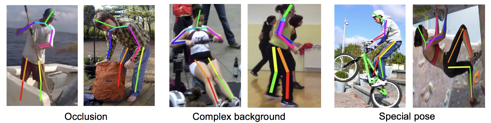
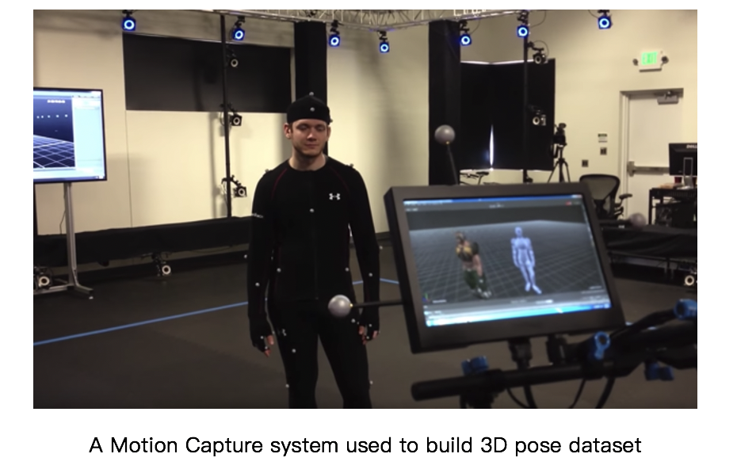
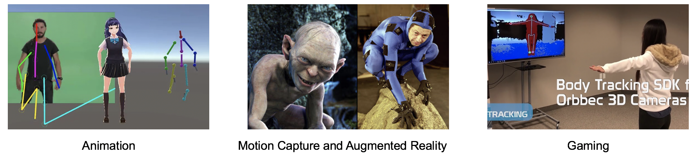
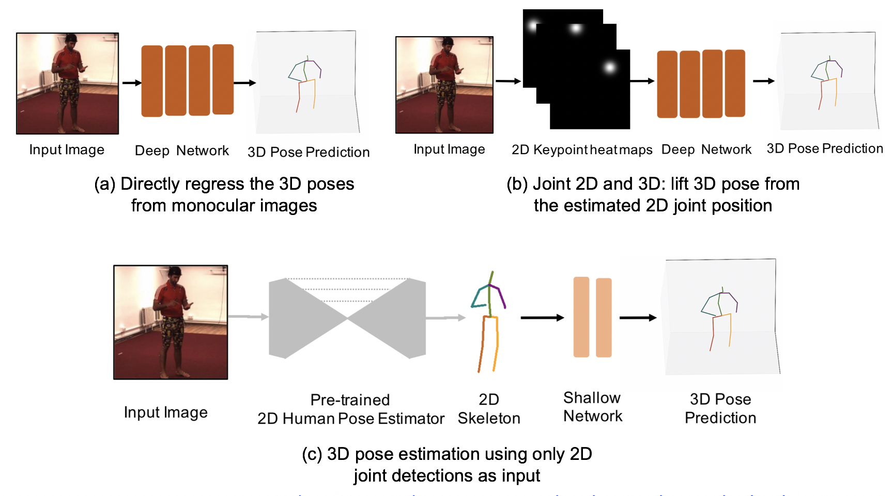
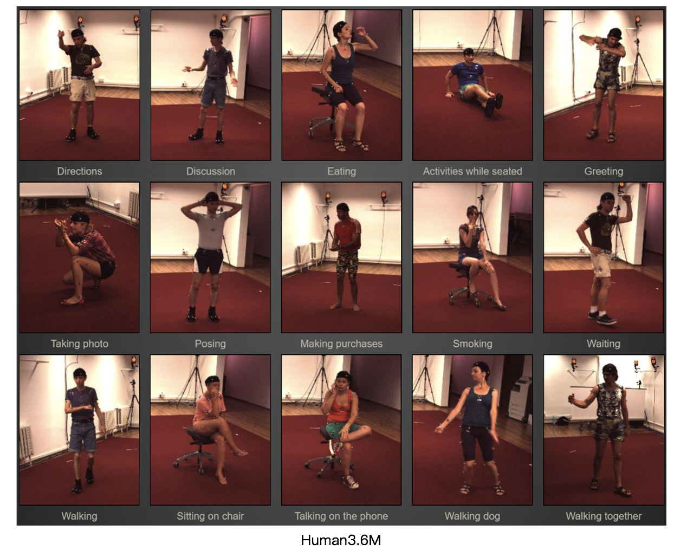
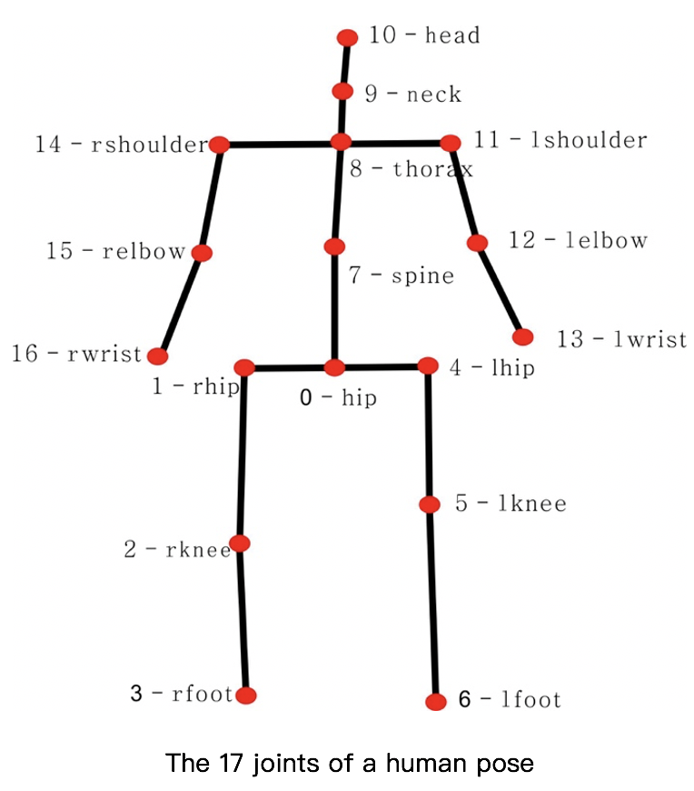

# 3D Human Pose Estimation Notes

中文版：[3D人体姿态估计笔记](https://zhuanlan.zhihu.com/p/113024569)

## Pose Estimaiton

Human Pose Estimation: the problem of localization of human joints (or) keypoints (regression problem)

- RGB or RGBD
- lmage or video
- Monocular or multiple view
- Single person or multiple person
- 2D or 3D pose estimation
- 3D pose or 3D shape

  

## 2D Pose Estimation

### Task

- Single-Person Skeleton Estimation

  - Benchmark: MPII (2014)
  - Representative work: CPM (CVPR 2016), Hourglass (ECCV 2016)

- Multi-person Pose Estimation

  - Benchmark: COCO (2016), CrowdPose (2018)
  - Bottom-up: OpenPose (CVPR 2017), Associative Embedding (NIPS 2017)
  - Top-down: CPN (CVPR 2018), MSPN (Arxiv 2018), HRNet (CVPR 2019)

- Video Pose Tracking

  - Benchmark: PoseTrack (2017)
  - Representative work: Simple Baselines (ECCV 2018)

  

### Challenge

- Occlusion
- Complex background
- Special pose

  

## 3D Pose Estimation 

### Problem

- Estimate a 3D pose (x, y, z) coordinates from a RGB image or video (regression problem)
- Input:  an image of a person
- Output: 3D human pose that matches the spatial position (N×3 keypoints)

  

### Challenge

- Larger 3D pose space and self-occlusions
- Depth ambiguity, ill-posed nature (multiple 3D poses can map to the same 2D keypoints)
- Lack of a larger 3D pose dataset in the wild (major bottleneck)
  - Lack of a special pose dataset (tumbling, rolling)
  - Limit their generalizability due to the constrained lab environment)
  - Obtain a 3D pose dataset is difficult and expensive (require a complicated laboratory setup with motion capture sensors and cameras)

  

### Application

- Animation, gaming
- Motion capture system
- Action understanding
- Provide a auxiliary to other task (Person-reID)
- Multi-task learning (Human parsing)

  

### Method

- Directly regress the 3D poses from monocular images
  - 3D Human Pose Estimation from Monocular Images with Deep Convolutional Neural Network (ACCV 2014)
  - Coarse-to-Fine Volumetric Prediction for Single-Image 3D Human Pose（Volumetric representation, 3D heatmap) (CVPR 2017)
- First estimate 2D poses and then lift 2D pose to 3D pose
  - Joint 2D and 3D: lift 3D pose from the estimated 2D joint position
    - Towards 3D Human Pose Estimation in the Wild (ICCV 2017)
    - 3D Hand Shape and Pose Estimation from a Single RGB Image (CVPR 2019)
    - Both categories require sophisticated deep network architectures and abundant annotated training samples. 
  - 3D pose estimation using only 2D joint detections as input
    - Simple Yet Effective Baseline (ICCV 2017)
    - 3D human pose estimation in video with temporal convolutions (CVPR 2019)
    - 2D joint detections: Hourglass (ECCV 2016), CPN (CVPR 2018)
    - Advantages
      - For 2D pose, existing large-scale datasets have provided sufficient annotations. Pre-trained 2D pose estimators are mature enough to be deployed elsewhere. 
      - For 2D to 3D reconstruction, infinite 2D-3D pose pairs can be generated by projecting each 3D pose into 2D poses under different camera views.
      

  

### Benchmark

- Human3.6M (2014)
  - The largest publicly available dataset for 3D human pose estimation
  - 3.6 million video frames, 4 different viewpoints
  - 15 actions: directions, discussion, eating, greeting, phoning, posing, purchases, sitting, sitting down, smoking, taking photo, waiting, walking, walking dog, walking together
  - 11 subjects, 7 professional actors are annotated with 3D poses
    - Training: S1, S5, S6, S7, S8 (1559752 samples)
    - Testing: S9, S11 (550644 samples)
- HumanEva (2010)
- MPI-INF-3DHP (2017)

  

  

### Evaluation Metrics

- Mean Per Joint Position Error (MPJPE): Protocol 1
  - Mean of per joint Euclidean distance between ground truth and prediction for all joints 
- Procrustes analysis MPJPE (P-MPJPE): Protocol 2
  - Error after alignment with the ground truth in translation, rotation, and scale
- Percentage of Correct Key-points (PCK)
  - Detected joint is considered correct if the distance between the predicted and the true joint is within a certain threshold
- Percentage of Correct Parts (PCP)
  - A limb is considered detected and a correct part if the distance between the two predicted joint locations and the true limb joint locations is at most half of the limb length (PCP at 0.5 )

### Supervised Method

- Weakly-Supervised
  - Depth, Point cloud, Mesh, GAN, Reprojection the 3D to 2D
- Semi-supervised
  - Reprojection the 3D to 2D
- Self-Supervised 
- Fully-Supervised

### The benefit of using video

- Direct estimation of 3D pose from disjointed images leads to temporally incoherent output with visible jitters and varying bone lengths. 
- The  future frames can benefit from past video information about human poses. This is beneficial when the pose of a person is ambiguous or the body is partially occluded in a given frame. Here, past information can help resolve and constrain the pose estimate.

## 3D Shape Estimation
### Problem

3D reconstruction is the process of estimating the 3D geometry from one or more 2D images

### 3D shape representation

- Depth
- Point cloud
- Voxel
- Mesh

...

  
